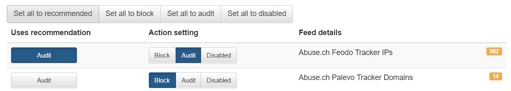

Quickstart
==========

Creating the portal account
---------------------------

After accessing the URL from your activation email, you will be asked to setup the password for your account. We don't enforce any password complexity, but we recommend using unique and non-trivial password. An unauthorized access would be a threat to users privacy and could misuse the configuration to harm your network.

.. image:: ./img/password_setup.png
   :align: center

After the password setup you will be asked to login using your username and newly created password.

.. image:: ./img/login.png
   :align: center

Public network ranges
---------------------

Public network range definition serves to distinguish individual customers and their users. It is necessary to include all the public network ranges that will be used by DNS resolver as well as the users browsing the internet. The definition is used to customize the block page appearance (described later).
Single customer can manage more network ranges, such ranges can be assigned to localities to easily distinguish between logical network zones in DNS traffic audit and incidents.
The networks can be configured under ``Cloud resolvers``.

.. image:: ./img/client_networks.png
   :align: center

.. warning:: Should you not fill in your public network ranges, cloud resolvers will serve as a simple DNS resolvers **without any filtering**. If you use local resolvers, you still have to input your network ranges to display fully customized blocking page (sinkhole) to the blocked users.

* Into the field ``IP Range`` insert one or more network ranges using notation <network address>/<mask>, e.g.: ``198.51.100.0/24`` 
* Press button ``Add IP range`` to add more segments of the network.
* Don't forget to save your new setup through the ``Save to resolver`` button

.. tip:: While testing Whalebone (e.g. through adding a testing domain into blacklist) don't forget that many DNS records could be recently in the DNS cache anywhere between the resolver and the user (including the browser, operating system or forwarders). Testing right after the configuration change could therefore fail and the timespan before the protection becomes active could vary based on the TTL of the particular DNS record (should all the caches along the way actually honor the TTL value).

Feed filtering options
----------------------

Every Threat Intelligence Feed could be setup in a different manner. As long as the button ``Uses recommendation`` is pressed the configuration is left to the Whalebone specialist and it honors the Whalebone best practice. If you prefer your own configuration you can choose from these three options:

* **Block**
* **Audit**
* **Disabled**

Cloud DNS resolvers
--------------------

You should forward your DNS traffic towards Whalebone cloud resolvers if this is your preferred deployment option. Cloud resolver are available on two independent IP addresses:
``52.169.120.89``
``52.166.249.114``

.. image:: ./img/resolver_ip.png
   :align: center

**Always use both IP addresses in your configuration** The guarantee of availability of the DNS resolution service is applied only in cases where both of the IP addresses are configured to use primary and secondary resolvers automatically. 

DNS traffic
-----------

Should the traffic be properly forwarded on Whalebone DNS resolvers (cloud or local) the DNS traffic will be visible under the menu option ``DNS traffic``, where the individual request and responses are available for further investigation.
The traffic should be visible in several minutes after everything has been properly setup. If there is no traffic recorded even in several hours don't hesitate to contact Whalebone support to help you doublecheck the configuration or any sort of network issues.

.. image:: ./img/dns_traffic.png
   :align: center

The DNS resolution check could be also done manually on Windows or Linux machines through ``nslookup`` tool. Set the Whalebone resolver IP and try to resolve an existing domain name.

.. image:: ./img/nslookup.png
   :align: center

