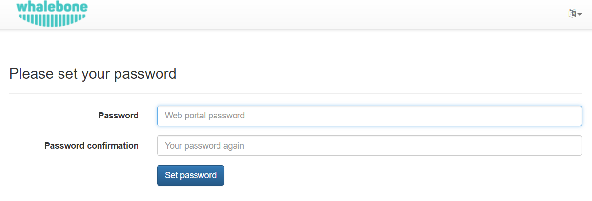
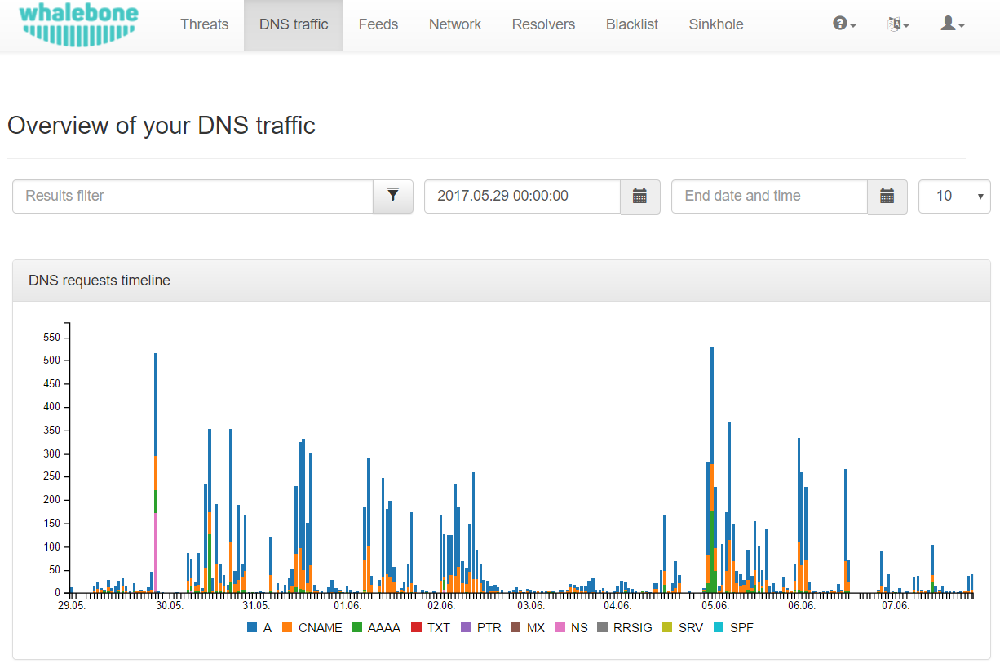

Quickstart
==========

Creating the portal account
---------------------------

After accessing the URL from your activation email, you will be asked to setup the password for your account. We don't enforce any password complexity but we recommend using unique and non-trivial password. An unauthorized access would be a threat to users privacy and could misuse the configuration to harm your network.



After the password setup you will be asked to login using your username and newly created password.

.. image:: ./img/login.png
   :align: center


DNS traffic view
----------------

If the traffic is correctly forwarded to Whalebone DNS resolvers (cloud or local), the DNS traffic will be visible under the menu option **DNS traffic**, where the individual requests and responses are available for further investigation.
The traffic should be visible in several minutes after everything has been properly setup. If there is no traffic recorded even in several hours don't hesitate to contact Whalebone support to help you doublecheck the configuration or any sort of network issues.



The DNS resolution check could be also done manually on Windows or Linux machines through ``nslookup`` tool. Set the Whalebone resolver IP and try to resolve an existing domain name.

```
   localhost:~$ nslookup whalebone.io
   Server:         193.32.92.32
   Address:        193.32.92.32#53

   Non-authoritative answer:
   Name:   whalebone.io
   Address: 75.2.70.75
   Name:   whalebone.io
   Address: 99.83.190.102
```