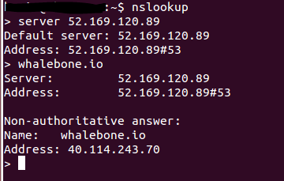

Quickstart
==========

Creating the portal account
---------------------------

After accessing the URL from your activation email, you will be asked to setup the password for your account. We don't enforce any password complexity but we recommend using unique and non-trivial password. An unauthorized access would be a threat to users privacy and could misuse the configuration to harm your network.

.. image:: ./img/password_setup.png
   :align: center

After the password setup you will be asked to login using your username and newly created password.

.. image:: ./img/login.png
   :align: center

Securing your resolver
-------------------------

Upon initial installation, the resolver is configured as an open resolver. It will respond to any request sent to it regardless of where the request originated from. This is quite 
comfortable in terms of availability of the services, but could also be a risk if the service is available from the outside networks. Please make sure you limit the access 
to the local resolver on port 53 (UDP and TCP) from the trusted networks only, otherwise it can be misused for various DoS attacks.

DNS traffic
-----------

Should the traffic be properly forwarded on Whalebone DNS resolvers (cloud or local) the DNS traffic will be visible under the menu option ``DNS traffic``, where the individual request and responses are available for further investigation.
The traffic should be visible in several minutes after everything has been properly setup. If there is no traffic recorded even in several hours don't hesitate to contact Whalebone support to help you doublecheck the configuration or any sort of network issues.

.. image:: ./img/dns_traffic.png
   :align: center

The DNS resolution check could be also done manually on Windows or Linux machines through ``nslookup`` tool. Set the Whalebone resolver IP and try to resolve an existing domain name.

