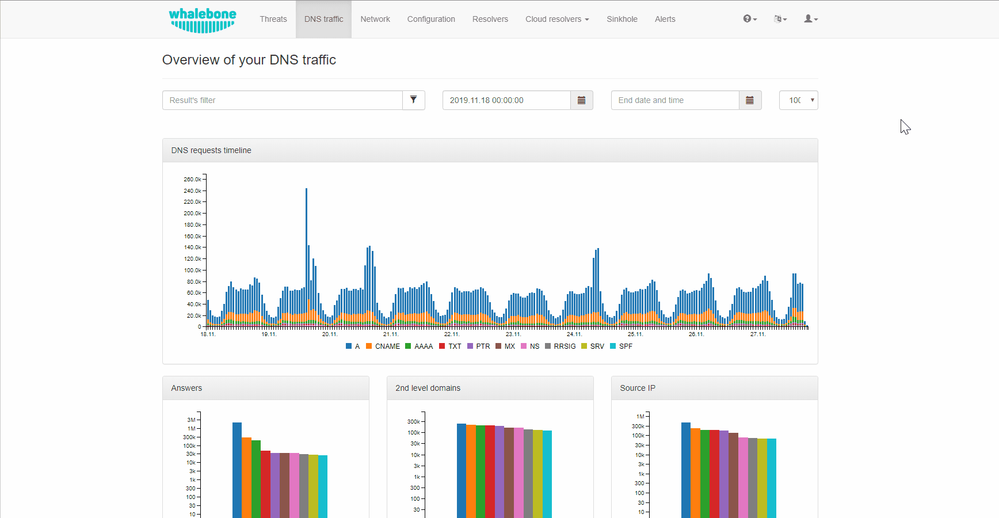

.. _header-n233:

Reporting
=============

Whalebone Portal provides the tools in order to configure various reporting options and manage the access to Whalebone API.

.. _header-n236:

Reports
-------

Reporting capabilities can be configured from the drop-down menu under a user's account.
The properties that can be customized, include the frequency that the reports are being delivered, the preferred day of the week, the language and the recipients.

.. note:: The default recipient is the owner of the account and the reports are delivered to their respective registered email address.

Alerts
-------
Whalebone alerting provides live updates about key information such as resolver's health, resolution status, hardware usage and it also informs about crucial security incidents and many more.
All of these information can be passed through multiple channels e.g. email, slack, syslog or webhook. You can create new alert from predefined template and alerts can be then customized by threshold, time and many others.

You can watch step-by-step video guide below:

.. raw:: html

   <iframe width="560" height="315" src="https://www.youtube.com/embed/GXUkPICav-o" title="YouTube video player" frameborder="0" allow="accelerometer; autoplay; clipboard-write; encrypted-media; gyroscope; picture-in-picture" allowfullscreen></iframe>

