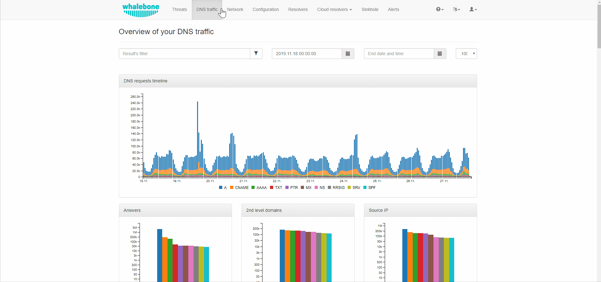
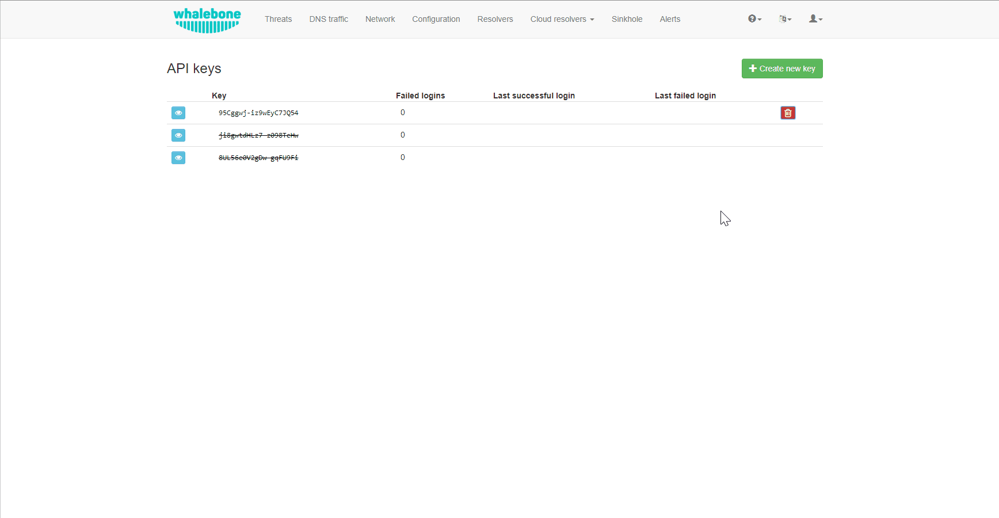

.. _header-n233:

Reporting
=============

Whalebone Portal provides the tools in order to configure various reporting options and manage the access to Whalebone API.

.. _header-n236:

Reports
-------

Reporting capabilities can be configured from the drop-down menu under a user's account.
The properties that can be customized, include the frequency that the reports are being delivered, the preferred day of the week, the language and the recipients.

.. note:: The default recipient is the owner of the account and the reports are delivered to their respective registered email address.

.. image:: ./img/report-configuration.gif
   :align: center

API
-------
Whalebone API is a practical way to access all the data that are gathered by Whalebone's resolvers and integrate them to external systems. The API documentation can be accessed at https://apidocs.whalebone.io/public/

In order to authenticate to the API, every user needs a set of `Access Key` and `Secret Key`. These can be managed from the option `API keys` on the dropdown menu, under the user's account. 

* **API Key Generation**

The generation of the API key can be achieved by clicking the `Generate new key` button.

.. note:: Make sure to copy the `Key secret` as it cannot be retrieved again.

* **API Key Revocation**

In case an API key gets lost or compromised, its revocation can be achieved  by the same menu.

