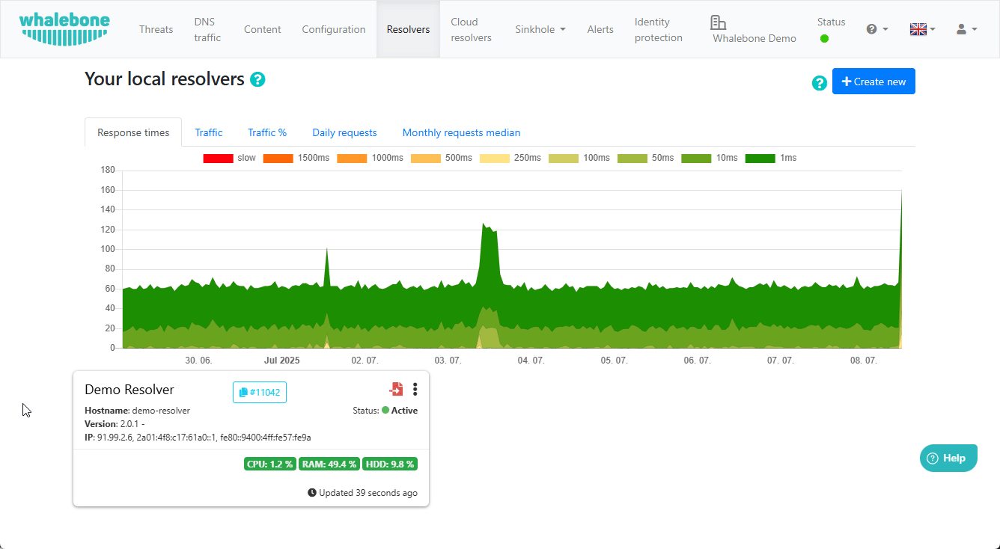
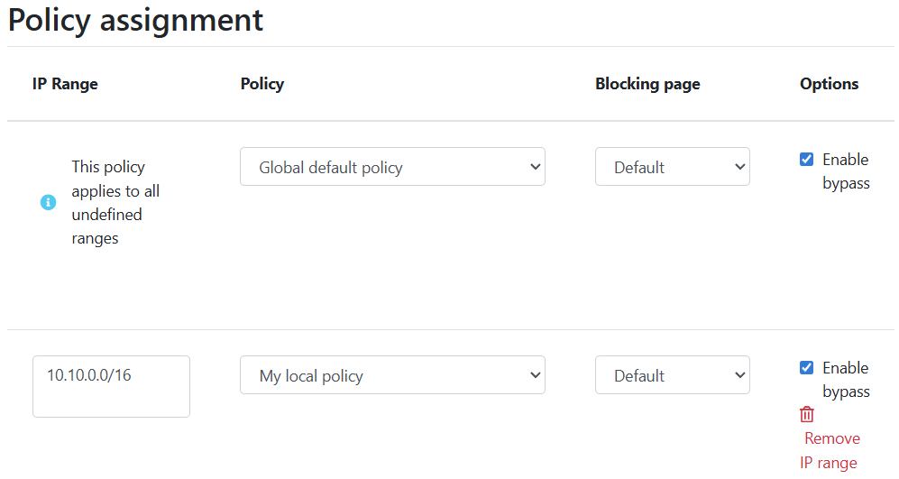
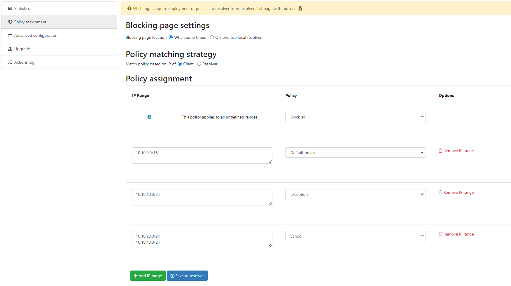
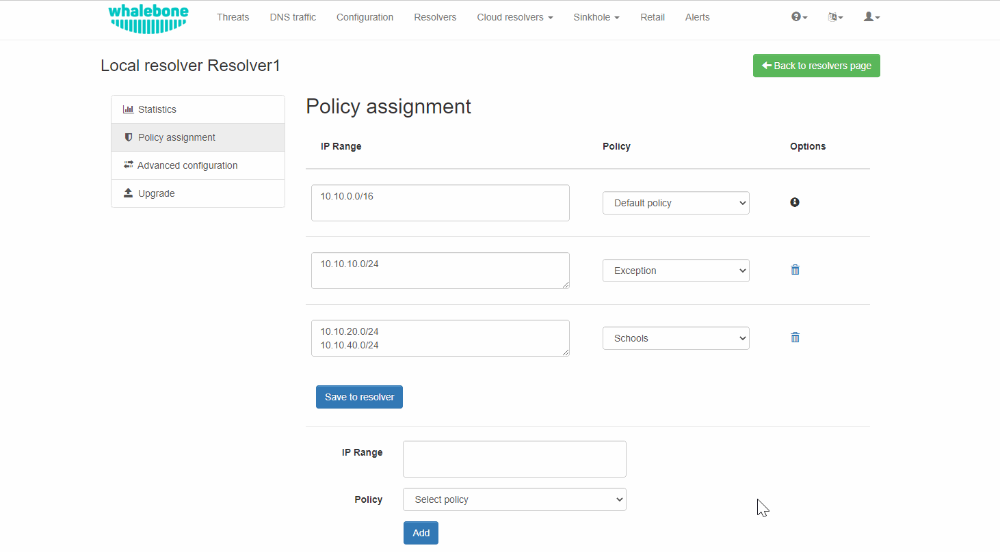
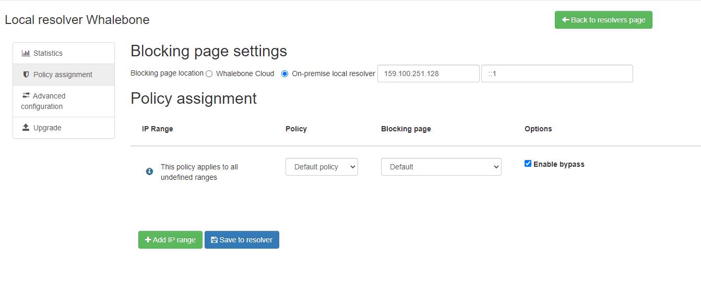

Resolver management
===================

On the **Resolvers** page, there is an overview of the created resolvers. Administrators can adjust the configuration, deploy updates, install new resolvers, and inspect detailed traffic and health metrics for each resolver.

Resolvers overview
------------------

In the main resolver overview, there are tiles with resolver details. Each tile shows the resolver name and ID, the hostname, the running version, one or more IP addresses, the operating system status indicator, and the live resource usage (CPU, RAM and HDD). The status of the communication channel between the resolver and the cloud is indicated by a color-coded dot next to the **Status** label.

The resolver can be in one of these states:

* **Active**: This is the expected status in production environments and signals that everything is running correctly.
* **Resolution problem**: The resolver is unable to translate DNS requests.
* **Unavailable**: The resolver has lost connection with Whalebone Cloud. This state does not affect the DNS translation; however, the resolver cannot get threat database updates and might not respond to policy or configuration changes initiated from the portal.
* **Upgrading**: An upgrade command has been issued to the resolver. This state should not persist for more than a few minutes.
* **Not installed**: The resolver was not yet installed.

Above the resolver cards, four chart tabs aggregate metrics across all your local resolvers:

* **Response times** — distribution of DNS query latencies by bucket (1 ms / 10 ms / 50 ms / 100 ms / 250 ms / 500 ms / 1000 ms / 1500 ms / slow).
* **Traffic** — absolute query volume over time.
* **Traffic %** — relative share per resolver.
* **Daily requests** — total daily request counts.

.. note:: If you have not yet installed a resolver, the page shows a **Create your first resolver** empty state with a **Create new** button. See :doc:`local_resolver` for installation steps.

Per-resolver actions
~~~~~~~~~~~~~~~~~~~~

Each resolver tile has a three-dot menu in the top-right corner with the following actions:

* **Edit resolver** — open the resolver detail page (also opened by clicking the resolver name).
* **Clear cache for domain** — flush the resolver cache entries for a single domain you specify.
* **Clear resolver cache** — flush the entire DNS cache on the resolver.
* **Trace domain** — run a domain resolution trace from this resolver.
* **Is this domain blocked?** — check whether a given domain would be blocked by the current policy.
* **Change name** — rename the resolver in the portal.
* **Delete resolver** — remove the resolver from the portal. This does not uninstall the software on the host; see :doc:`uninstalling`.

Deploy configuration
--------------------

If there have been any configuration changes that affect the DNS resolution, you have to **deploy** the configuration afterwards. Otherwise, the changes will not take effect. In case there are any configuration changes available to be deployed, there will be a **red icon** with a downward arrow visible on the resolver card. Once clicked, the webpage will ask for confirmation, and the successful deployment will be notified in the top right corner.

.. note:: If the deployment resulted in an error, try to repeat the action. The reason for the error could be a short-term communication outage between the cloud and the resolver.

The following animation demonstrates a configuration deployment to a resolver.

Resolver detail
---------------

Clicking the name of a resolver (or **Edit resolver** in the per-card menu) opens the resolver detail page. The page has six sub-sections, listed in the left sidebar:

* :ref:`statistics`
* :ref:`policy-assignment`
* :ref:`advanced-configuration`
* :ref:`upgrade`
* :ref:`actions-log`
* :ref:`integrations`

The right-hand column shows the resolver's **Hostname**, **Interface(s)** with assigned IP addresses, **Platform** (operating system), and **Version** for reference.

.. _statistics:

Statistics
~~~~~~~~~~

The default landing view for a resolver. Provides live operational charts:

* **Resolver response times** — queries grouped into latency buckets (1 ms / 10 ms / 50 ms / 100 ms / 250 ms / 500 ms / 1000 ms / 1500 ms / slow).
* **Health** — percentage of successful health checks over the observed interval.
* **CPU load** — CPU usage on the resolver host.
* **Memory usage / Swap usage / Disk usage** — memory pressure metrics.
* **Write count / Read count** — disk I/O operations.
* **Write bytes / Read bytes** — disk I/O throughput.
* **Packets received / Packets sent** — network packet counters.
* **Bytes received / Bytes sent** — network throughput.

.. _policy-assignment:

Policy assignment
~~~~~~~~~~~~~~~~~

The Policy assignment view groups three related settings.

Blocking page settings
""""""""""""""""""""""

* **Blocking page location** — choose between **Whalebone Cloud** (blocking pages served by Whalebone) and **On-premise local resolver** (blocking pages served from the resolver host). When **On-premise local resolver** is selected, two additional fields appear:

  * **IPv4 for Blocking page** — IPv4 address used for the blocking page. Should be set to the public IP of the resolver.
  * **IPv6 for Blocking page** — IPv6 address used for the blocking page. Should be set to the public IP of the resolver.

.. tip:: The Blocking Pages are hosted **directly** on the Resolvers, so the IP addresses that are advertised to the clients must be used. The clients will then be redirected to the IP address of the resolver upon blocking. Please ensure that ports 80 and 443 are accessible on the firewall.

Policy matching strategy
""""""""""""""""""""""""

The **Match policy based on IP of** option controls how the resolver decides which policy to apply to a DNS query:

* **Client** — match based on the IP of the client. Use this when you want policies driven by client-side IP ranges (for example, different policies per subnet of end-user devices).
* **Resolver** — match based on the IP of the resolver. Use this when the clients reach Whalebone through their own DNS server and you want the policy decided by that server's IP.

Policy assignment table
"""""""""""""""""""""""

Security and content policies can be assigned in a granular manner to different segments of the network. The setting applies per resolver and is configured under **Resolvers** → ``Name of the resolver`` → **Policy assignment**.

.. note:: The configuration is **per resolver**. To apply the same configuration to more than one resolver, repeat the setup on each.

Policies are applied by adding IP ranges in the available input form:

In order to provide a better understanding, let's consider an example with the network range ``10.10.0.0/16``.

We have created 3 different policies:

* **Default**: the policy that we want to apply to the whole network; this is the most generic policy.
* **Exception**: a policy that must be applied to a specific segment in the network, which will have all security and content filtering disabled.
* **Schools**: a policy that we want to apply to 2 different subnets that have been assigned to school environments. In this case, we have chosen to be more strict in the blocking.

.. figure:: ./img/policies-example-1.png
   :alt: Default policy
   :align: center

   Default policy

.. figure:: ./img/policies-example-2.png
   :alt: Exception policy
   :align: center

   Exception policy

.. figure:: ./img/policies-example-3.png
   :alt: Schools policy
   :align: center

   Schools policy

.. note:: The Default policy is applied to all undefined ranges. In case different policies affect the same range, the more granular policy is applied.

Let's summarize the requirements in the following matrix:

========== ===============================
**Policy** **Network**
========== ===============================
Default    10.10.0.0/16
Exception  10.10.10.0/24
Schools    10.10.20.0/24 and 10.10.40.0/24
========== ===============================

The following image shows the process of assigning the policies:

.. note:: After adding the networks, you must click on **Save to resolver** in order to take effect. The changes will then be validated, and a pop-up message will provide additional information.

In order to assign additional entries to an existing assignment, a new network range can be appended using a `newline` as a separator.

Building on the previous example, in case we wanted to add the subnet ``10.10.30.0/24`` to the Exception policy, we can simply add the subnet to the existing policy assignment:

For each IP range that is added, there is a drop-down menu for the Blocking Page that should be assigned.

   Assign Blocking Page to IP range

.. important:: The first entry in the **Policy assignment** is considered the Default/Fallback. In case a client accesses the resolver from an undefined IP range, the respective options will apply.

.. note:: After making the necessary changes to the Blocking Page settings, please check whether the resolvers need to be redeployed.

.. _advanced-configuration:

Advanced configuration
~~~~~~~~~~~~~~~~~~~~~~

The Advanced configuration view exposes resolver-level technical settings.

* **Choose DNS resolution configuration** — select a DNS resolution profile to apply to this resolver. Profiles are defined under :doc:`dns_resolution`. The default profile is **Default DNS resolution**.

Under **Expert settings** (collapsed by default) you can override the following defaults:

* **Disable DNS logging** — when enabled, the resolver does not record query logs locally. Use only when log volume or privacy requirements demand it; many features (Threats, Content) rely on these logs.
* **Adjust log rotation size** — override the default rotation size for resolver log files.
* **Syslog destinations** — add one or more remote syslog destinations the resolver will forward logs to. See :doc:`syslog_integration` for the available log files and formats.
* **Resolver process count** — override the number of resolution worker processes on the host.
* **Bind to all IPs** — when enabled (default), the resolver listens on every IP address of every interface configured on the host. Disable to restrict listening to a specific subset (configured via Whalebone support).

Click **Save** to persist changes. As with other configuration changes, deployment to the resolver is required.

.. _upgrade:

Upgrade
~~~~~~~

The Upgrade view shows the resolver's current version and release date and is split into three sub-tabs.

**Available upgrade**
    Shows whether a newer version is available for the current channel. If the resolver is up to date, the message **You're running the latest version and there are no new upgrades yet.** is displayed. When an upgrade is available, the upgrade procedure can be initiated from this tab.

**Upgrade channel**
    Lets you switch between the supported resolver release channels. Three channels exist:

    .. list-table::
       :header-rows: 1
       :widths: 15 20 65

       * - Channel
         - Status
         - Highlights
       * - **Version 3**
         - Current channel — main supported branch, new capabilities added continuously.
         - **Safe Search Enforcement** (Google, YouTube, Bing, DuckDuckGo, Ecosia; categories: Adult, Weapons, Child Abuse, Drugs, Terrorism, Violence). **Rate Limiting** (DDoS protection on UDP/53 — not available for DoH/DoT). **CPU-Aware Deferring** (throttles heavy clients when CPU spikes). **Static DNS Records** including SRV (A, AAAA, CNAME, TXT were already supported). Includes all features from Version 2.
       * - **Version 2**
         - Patch-only — security and bug fixes, no new features.
         - **Comprehensive Threat Intelligence** (lifts the database-size constraints of 1.0.96 and earlier). Optional **Active Directory integration** module — enriches logs with device hostnames via reverse DNS.
       * - **Version 1**
         - End of life — no further patches.
         - Upgrade to Version 2 to keep receiving security patches.

    To move between channels, click **Switch to this version** on the desired channel card.

    .. note:: Several Version 3 features (**Rate Limiting**, **CPU-Aware Deferring**, **Static DNS Records**) are configured via a YAML file by Whalebone Technical Support and are not exposed in the Admin Portal UI.

**Rollback**
    If the most recent upgrade did not yield the expected outcome, the previous version can be re-applied here. When no previous version is recorded for the resolver, the tab shows **There is no previous version**.

.. image:: ./img/rollback.png
   :align: center

.. _actions-log:

Actions log
~~~~~~~~~~~

A chronological audit trail of every action issued to this resolver — create, configuration deploys, upgrades, rollbacks, and so on. Each entry shows the timestamp, the action type, and the result (for example, *Action was completed successfully*). Use this view to debug failed deployments or to confirm when a change actually reached the resolver.

.. _integrations:

Integrations
~~~~~~~~~~~~

The Integrations view groups optional features that enrich the resolver's behavior with data from your environment. Currently, one integration is available.

Device name lookup
""""""""""""""""""

Enriches DNS logs with device hostnames resolved from PTR records on your authoritative nameserver(s). See :doc:`active_directory` for the conceptual overview.

.. note:: This feature requires the latest resolver version. The portal displays a banner with an **Upgrade Resolver version** link if the installed resolver is too old.

.. important:: All changes to integration settings require deployment of policies to the resolver from the Resolvers list page.

The following fields are available:

* **Log device names in your network traffic** — master on/off toggle for the integration.
* **Network segmentation** — choose whether the resolver should use a single authoritative nameserver list (**No**) or use authoritative nameservers per network segment as configured in :doc:`dns_resolution` (**Yes**).
* **Authoritative nameservers** — list of IPs (and optional **Advanced setup**) used for reverse (PTR) lookups when network segmentation is **No**.
* **Reverse DNS query timeout** — per-query timeout in milliseconds (default ``500``).
* **Success Cache capacity initial** — number of entries the success cache is pre-allocated to hold (default ``1000``).
* **Success Cache capacity max** — maximum number of entries the success cache can hold (default ``10000``).
* **Success Cache capacity TTL** — minimum alternative cache TTL for successful PTR responses, in minutes (default ``10``).
* **Failure Cache capacity initial** — number of entries the failure cache is pre-allocated to hold (default ``1000``).
* **Failure Cache capacity max** — maximum number of entries the failure cache can hold; when full, a random item is evicted (default ``10000``).
* **Failure Cache TTL** — minutes that failed PTR queries are remembered before being retried (default ``10``).

Click **Save** to persist changes.
