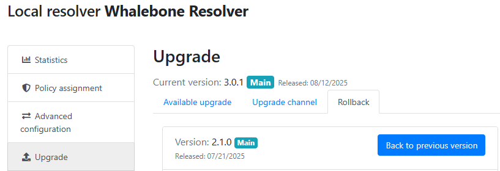

Resolver management
===================

On the **Resolvers** page there is an overview of created resolvers. Administrator can adjust the configuration, deploy updates and install new resolvers.

Resolvers overview
------------------

In the main resolver overview there are tiles with resolver details and configuration options. The overview includes information about operating system and resources as CPU, Memory and HDD usage. There is also the status of the communication channel between the resolver and the cloud indicated by the color-coded dot.

The resolver can be in one of these states:

* **Active** - This is the expected status in production environments and signalizes that everything is running correctly. 
* **Resolution problem** - The resolver is unable to translate DNS requests.
* **Unavailable** - The resolver has lost connection with Whalebone Cloud. This state does not affect the DNS translation.
* **Upgrading** - An upgrade command has been issued to the resolver. This state should not persist for more than a few minutes.
* **Not installed** - The resolver was not yet installed. 

Deploy configuration
--------------------

Should you change any configuration related to the DNS resolution, you have to deploy the configuration afterwards. Otherwise the changes will not take effect. If there are any configuration changes available to be deployed, there will be a red icon with down right arrow visible on the resolver card. Once clicked, the webpage will ask for confirmation and the successful deployment will be notified in the top right corner.

.. note:: If the result is an deployment error, try to repeat the action. The reason for the error could be a short term communication outage between the cloud and the resolver.

.. image:: ./img/lrv2-deployconfig.gif
   :align: center

Configure Policy per Network Segment
------------------------------------
Security and content polices can be asssigned in a granular manner to different segments of the network. 

The setting applies per resolver and can be configured under **Resolvers** > ``<Name of the resolver>`` > **Policy Assignment** 

.. note:: The configuration is **per resolver**. In case you want to apply the configuration to more than one resolvers, please modify all the necessary resolvers. 

The policies can be applied by adding IP ranges in the available input form:

.. image:: ./img/add-policy.PNG
   :align: center

In order to provide a better understanding let's consider an example with the network range ``10.10.0.0/16``. 
We have created 3 different policies: 

* **Default**: the policy that we want to apply to the whole network, this is the most generic policy
* **Exception**: a policy that must be applied to a specific segment in the network which will have all security and content filtering disabled.
* **School**: a policy that we want to apply to 2 different subnets that have been assigned to school environments. In this case we have chosen to be more strict in the blocking.

.. image:: ./img/policies-example.png
   :align: center

.. note:: The first policy that is defined acts as a **default** policy and is applied in cases where a more granular policy for a network range is not available. This policy is always on the top of the list, is marked with a special icon and cannot be deleted. 

Let's summarize the requirements in the following matrix:

========== ===============================
**Policy** **Network**
========== ===============================
Default    10.10.0.0/16
Exception  10.10.10.0/24
School     10.10.20.0/24 and 10.10.40.0/24
========== ===============================

In the following capture the process of assigning the policies is described:

.. image:: ./img/policy-assignment.gif
   :align: center

.. note::  After adding the networks, and in order to take effect, you must click on `Save to resolver`. The changes will be then validated and a pop-up message will provide additional information.

In order to assign additional entries to an existing assignment, a new network range can be appended using `newline` as a separator.
Building on the previous example, in case we wanted to add the subnet ``10.10.30.0/24`` to the Exception Policy:

.. image:: ./img/add-range.gif
   :align: center

Configure Blocking Pages
-------------------------

In a similar manner to the Security Policies, the Blocking Pages can also be assigned to particular network ranges.

The first step is to select ``On-premise local resolver`` for the ``Blocking Page Location`` option. Two new fields are enabled where the IPv4 and IPv6 addresses of the Blocking Pages must be filled in.

.. tip:: The Blocking Pages are being hosted **directly** on the Resolvers so the IP addresses that are advertised to the clients must be used. The clients will then be redirected to the IP address of the resolver upon blocking. Please ensure that ports 80 and 443 are accessible on the firewall.

For each IP range that is added, there is a drop-down menu for the Blocking Page that should be assigned. 

.. figure:: ./img/blocking-page-assign.png
   :alt: Assign Blocking Page to IP range
   :align: center
   
   Assign Blocking Page to IP range

.. important:: The first entry in the ``Policy Assignment`` is considered the Default/Fallback. In case a client accesses the resolver from an undefined IP range, the respective options will apply.

.. note:: After making the necessary changes to the Blocking Page settings, please check whether the resolvers need to be re-deployed.  

Upgrade/Rollback Resolver
------------------------------------

When a new version of the Resolver is released, a red ``Upgrade`` icon appears on the resolvers' management interface.

Upon clicking on the ``Upgrade`` icon, the respective menu is selected and important information about the new release is provided. 

.. image:: ./img/upgrade-2.png
   :align: center

From this menu, the upgrade of the resolver can be initiated.

In case the installation of the new version does not yield the expected outcome, a Rollback to the previous version is possible anytime in the **Rollback** tab:

