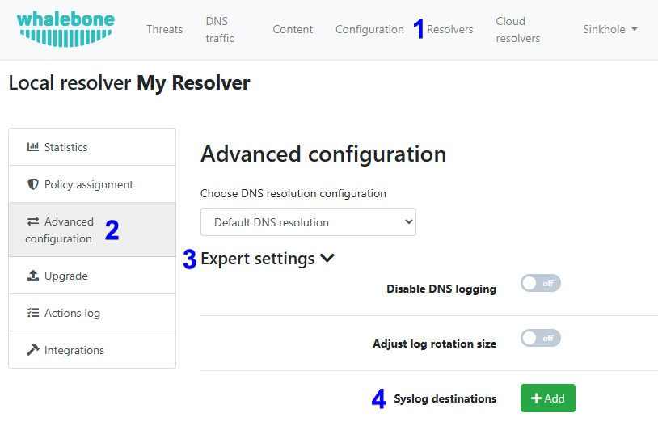

==================
Syslog Integration
==================

Whalebone's syslog integration provides a reliable, real-time export of security and operational data directly from each Whalebone local resolver to industry-standard SIEM tools such as Splunk, Elastic, or any compatible external log management solution. This capability enables organizations to centralize log ingestion, correlate DNS security events with other data sources, and build automated detection and response workflows. By streaming events in standard syslog format, it ensures seamless integration into existing monitoring infrastructures while supporting compliance, auditing, and advanced threat analysis requirements.

Syslog integration can be enabled on the Admin Portal under Resolvers > Edit resolver > Advanced Configuration > Expert settings.

Requirements
------------

* The resolver with an enabled syslog integration can open a connection to the destination external log management solution on the port specified in the resolver's settings. The protocol is UDP by default.

Log files
---------

Administrators have the ability to specify which type of data they want to export. The description of individual log files is below:

* **content.log**: Domains blocked by the content filter.

* **debug.log**: Additional debugging data. This file contains data only when the debug mode is enabled by a Whalebone technician.

* **metrics.log**: Metrics related to the operating system, disk usage, CPU usage, memory usage, Docker run-time statistics, and individual Whalebone services.

* **passivedns.log**: All DNS traffic.

* **whalebone.log**: All detected threats.

* **agent/agent-docker-connector.log**: List of Docker removed containers. Docker containers are removed/replaced during updates or configuration changes.

* **agent/agent-lr-agent.log**: Communication overview and detailed configuration obtained from Whalebone cloud.

* **agent/agent-main.log**: Health check messages related to the lr-agent service.

* **agent/agent-status.log**: The status of the listener, which receives configuration updates from Whalebone cloud.

.. note:: The most important log files are content.log, passivednslog, and whalebone.log. The rest is mainly for troubleshooting or debugging purposes.

Examples
--------

Here are some examples of the most frequently users logs content.log, passivedns.log, and whalebone.log files:

content.log
^^^^^^^^^^^

.. code-block:: python

    {
        "timestamp": "2025/06/12 06:44:27.049917",
        "action": "block",
        "server_ip": "192.168.0.10",
        "client_ip": "192.168.10.41",
        "domain": "whalebone.com",
        "ioc": "whalebone.com",
        "identity": "wb-default-policy",
        "mobile_client_id": "",
        "device_id": "",
        "content_types": [
            "social-networks"
         ],
        "legal_types": [],
        "app_blocked_intersect": [],
        "scheduled_filter": [],
        "scheduled_internet": "false",
        "policy_name": "",
        "policy_group_id": "",
        "policy_tags": "",
        "pin": "0",
        "region": "eu-01",
        "segment_id": "",
        "brand_id": "",
        "subscription_id": "",
        "answer": "SINKHOLE_IP",
        "sinkhole_type": "1",
        "port": "56121",
        "type": "A",
        "rcode": "0",
        "matrix": {
            "content": "true",
            "advertisement": "false",
            "legal": "false",
            "whitelist": "false",
            "blacklist": "false",
            "bypass": "false",
            "apps_blocked": "false",
            "apps_allowed": "false"
        }
    }

Important fields in the content.log file:

- **timestamp**: The date and time when the event occurred.

- **action**: The action taken by the resolver (e.g., "block" or "allow").

- **client_ip**: The IP address of the client that made the DNS request.

- **server_ip**: The IP address of the resolver that processed the DNS request.

- **domain**: The domain name that was requested.

- **type**: The type of DNS record (e.g., "A", "AAAA", "CNAME").

passivedns.log
^^^^^^^^^^^^^^

.. code-block:: python

    {
        "response_time": "2025-07-24T06:16:50.140828Z",
        "client": "192.168.10.41",
        "server": "192.168.0.10",
        "class": "IN",
        "type": "A",
        "query_port": 39170,
        "response_port": 53,
        "query": "whalebone.com.",
        "answer": "3.33.251.168",
        "identity": "wb-default-policy",
        "ttl": 1,
        "res_action": "allow",
        "ede_code": -1,
        "protocol": "UDP",
        "region": "eu-01",
        "rtt": 0
    }

Important fields in the passivedns.log file:

- **response_time**: The date and time when the response was sent.

- **client**: The IP address of the client that made the DNS request.

- **server**: The IP address of the resolver that processed the DNS request.

- **query**: The domain name that was requested.

- **answer**: The IP address returned in the DNS response.

- **res_action**: The action taken by the resolver (e.g., "allow" or "block").

- **ede_code**: The Extended DNS Error code, which provides additional information about the DNS response.

- **type**: The type of DNS record (e.g., "A", "AAAA", "CNAME").

whalebone.log
^^^^^^^^^^^^^

.. code-block:: python

    {
        "timestamp": "2025/08/18 13:07:20.460737",
        "action": "block",
        "server_ip": "192.168.0.10",
        "client_ip": "192.168.10.41",
        "domain": "spam.test.attacker.online",
        "ioc": "spam.test.attacker.online",
        "identity": "wb-default-policy",
        "mobile_client_id": "",
        "device_id": "",
        "accuracy": "100",
        "threat_types": [
            "spam"
        ],
        "app_blocked_intersect": [],
        "scheduled_internet": "false",
        "policy_name": "",
        "policy_group_id": "",
        "policy_tags": "",
        "pin": "0",
        "region": "eu-01",
        "segment_id": "",
        "brand_id": "",
        "subscription_id": "",
        "answer": "SINKHOLE_IP",
        "sinkhole_type": "8",
        "port": "63559",
        "type": "HTTPS",
        "qclass": "IN",
        "rcode": "0",
        "ede_code": -1,
        "protocol": "UDP",
        "matrix": {
            "accuracy_audit": "true",
            "accuracy_block": "true",
            "content": "false",
            "advertisement": "false",
            "legal": "false",
            "whitelist": "false",
            "blacklist": "false",
            "bypass": "false",
            "apps_blocked": "false",
            "apps_allowed": "false"
        }
    }

Important fields in the whalebone.log file:

- **timestamp**: The date and time when the event occurred.

- **action**: The action taken by the resolver (e.g., "block", "audit", or "allow").

    - "block": The DNS request was blocked, and the client received a response with the blocking page's IP address.

    - "audit": The DNS request was logged for auditing purposes. This type of action is used for monitoring and analyzing traffic without interfering with the clients' normal behavior.

    - "allow": The DNS query was allowed based on the user's request to bypass the blocking the page.

- **client_ip**: The IP address of the client that made the DNS request.

- **server_ip**: The IP address of the resolver that processed the DNS request.

- **domain**: The domain name that was requested.

- **accuracy**: Accuracy expresses the confidence level that a domain is truly dangerous, based on multiple factors such as security vendor consensus, amount of traffic across Whalebone resolvers, suspicious communication patterns, and results from internal research. The value ranges from 0 to 100, where 100 indicates the highest confidence that the target domain provides a malicious content.

- **threat_types**: The type of threat detected (e.g., "spam", "phishing", "malware").

Limitations
-----------

* The syslog integration uses the UDP protocol. Please contact Whalebone HelpDesk if you want to use the TCP or TLS protocol.
