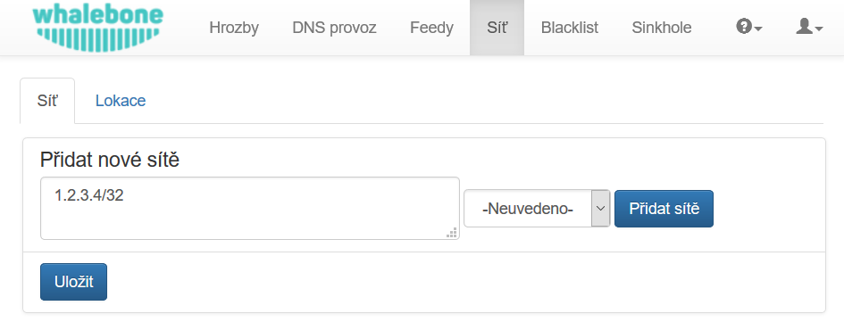
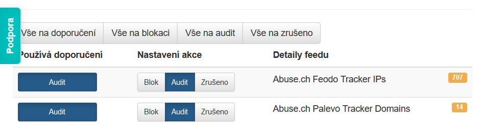

Začínáme
========

Založení účtu v portálu
------------------------

Po otevření odkazu z aktivačního emailu si nastavte heslo k vašemu účtu. Nevynucujeme žádná pravidla složitosti hesla, ale doporučujeme dostatečně silné heslo pro ochranu vašeho účtu. Získáním přístupu může dojít k narušení soukromí uživatelů nebo zneužití konfigurace služby.

.. image:: ./img/password_setup.png
   :align: center

Po změně hesla budete vyzváni k prvnímu přihlášení pomocí vašeho uživatelského jména a nově zvoleného hesla.

.. image:: ./img/login.png
   :align: center

Po prvním přihlášení se zobrazí průvodce, který vás provede hlavními možnostmi portálu. Můžete ho kdykoliv ukončit a případně znovu spustit z menu po ikonkou otazníku a volbou ``Zobrazit nápovědu``.

.. image:: ./img/help.png
   :align: center

Definice síťových rozsahů
-------------------------

Síťové rozsahy slouží k rozeznávání provozu jednotlivých zákazníků. Doporučujeme uvádět celou podsíť, ze které může přijít jak DNS provoz, tak další síťový provoz. Sítí a adres může být uvedeno více a mohou být rozčleněny do tzv. lokalit pro snazší kategorizaci DNS provozu a detekovaných událostí. 

* Do pole ``Přidat nové sítě`` vložte jeden nebo více síťových rozsahů v notaci <adresa sítě>/<bitová maska>, např: ``198.51.100.0/24`` 
* Stisknutím tlačítka ``Přidat sítě`` můžete přidávat postupné změny
* Na závěr nezapomeňte všechny změny zapsat tlačítkem ``Uložit``

.. tip:: Při testování filtrace (např. přidáním testovací domény do vlastního blacklistu) nezapomeňte, že mnoho DNS záznamů může být aktuálně zaneseno v DNS cache kdekoliv po cestě (v browseru, operačním systému nebo resolveru). Test otevřením stránky v browseru chvíli po nasazení filtrace Whalebone může tedy selhat a doba do zapomenutí/obnovení DNS cache pro danou doménu bude závislá na velikosti TTL.

Nastavení vlastností filtrace
-----------------------------

Každý zdroj informací o hrozbách (Threat Intelligence Feed) může být nastaven jiným způsobem. Pokud je stisknuté tlačítko ``Používá doporučení``, řídí se nastavení doporučením provozovatele služby Whalebone. Pokud preferujete vlastní nastavení, můžete vybrat vlastní akci z možných tří voleb: 

* **Blok**
* **Audit**
* **Zrušeno**

Cloudové DNS resolvery
----------------------

Na cloudové DNS resolvery služby Whalebone nasměrujte požadovaný provoz. Buď svých aktuálních resolverů, routerů nebo přímo jednotlivých počítačů a dalších zařízení. K dispozici jsou překladače dostupné na dvou nezávislých IP adresách::
``52.169.120.89``
``52.166.249.114``

.. image:: ./img/resolver_ip.png
   :align: center

**V konfiguraci vždy používejte IP adresy obou překladačů.** Garance dostupnosti služby se vztahuje pouze na případy využití obou IP adres v konfiguracích, aby došlo k automatickému využití sekundárního DNS překladače při výpadku primárního.

Kontrola provozu
----------------

Jestli je provoz správně nasměrován na DNS resolvery Whalebone je možné zkontrolovat z portálu Whalebone pod položkou „DNS provoz“, kde jsou zaznamenávány jednotlivé DNS dotazy.
Pokud je vše správně nakonfigurováno a funkční, bude v grafu v řádu jednotek minut viditelný DNS provoz. Pokud DNS provoz nebude na úrovni služby viditelný, překontrolujte manuálně dostupnost cloudových resolverů ze zdrojových zařízení.

.. image:: ./img/dns_traffic.png
   :align: center

Kontrolu je možné provést identicky ze strojů s OS Windows i Linux pomocí nástroje ``nslookup``. Po jeho spuštění nastavte IP adresu Whalebone resolveru a zkuste přeložit doménové jméno existující domény.

.. image:: ./img/nslookup.png
   :align: center

